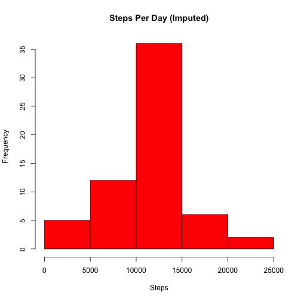
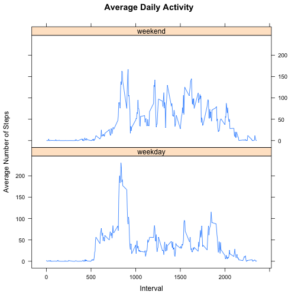

###Load packages and read in the data.

```r
library(lattice)
library(dplyr)
act <- read.csv("activity.csv")
act$date <-as.Date(act$date, "%Y-%m-%d")
```

###Calculate total number of steps per day.

```r
acts <- tapply(act$steps, act$date, sum, na.rm = TRUE)
acts <- acts[acts>0]
hist(acts, col = "red", main = "Steps Per Day", xlab = "Steps")
```

 

```r
paste("The mean is", mean(acts))
```

```
## [1] "The mean is 10766.1886792453"
```

```r
paste("The median is", median(acts))
```

```
## [1] "The median is 10765"
```

###Average daily activity pattern.

```r
acts <- tapply(act$steps, act$interval, mean, na.rm = TRUE)
plot(names(acts), acts, type = 'l', lwd = 2, col = "red", xlab = "Interval", ylab = "Average Number of Steps", main = "Average Daily Activity")
```

 

```r
paste("The maximum average daily activity occurs during interval", names(which.max(acts)))
```

```
## [1] "The maximum average daily activity occurs during interval 835"
```

###Impute missing values.
(imputed using average value per day for the interval)

```r
paste("The number of missing values is", sum(is.na(act$steps)))
```

```
## [1] "The number of missing values is 2304"
```

```r
act2 <- act
for(i in 1:17568){
  if(is.na(act2[i, 1])){
    act2[i, 1] <- acts[as.character(act2[[i,3]])]
  }
}
acts2 <- tapply(act2$steps, act2$date, sum)
hist(acts2, col = "red", main = "Steps Per Day (Imputed)", xlab = "Steps")
```

 

```r
paste("The imputed mean is", mean(acts2))
```

```
## [1] "The imputed mean is 10766.1886792453"
```

```r
paste("The imputed median is", median(acts2))
```

```
## [1] "The imputed median is 10766.1886792453"
```
The mean has not changed, and the median has only increased by a little more than one step per day.  The shape of the histogram is the same, though the middle peak is now taller.

###Weekdays vs Weekends

```r
act2$day <- weekdays(act2$date)
for(i in 1:17568){
  if(act2[[i,4]] == "Saturday" | act2[[i,4]] == "Sunday"){
    act2[i, 4] <- "weekend"
  }
  else{
    act2[i, 4] <- "weekday"
  }
}
act3 <- group_by(act2, interval, day)
act4 <- summarize_each(act3, funs(mean), steps)
act4 <- transform(act4, day = factor(day))
xyplot(steps~interval | day, data = act4, layout = c(1,2), type = "l", xlab = "Interval", ylab = "Average Number of Steps", main = "Average Daily Activity")
```

 
